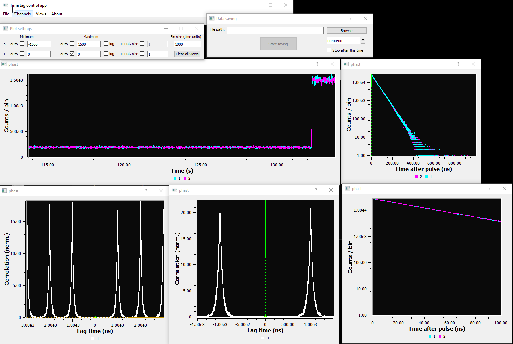

# About
PHoton Arrival-time STudio (PHAST) is a GUI application for time-correlated single-photon counting (TCSPC) experiments. It can control time-to-digital converters (TDCs, aka 'time taggers'), process the data, and display---in real time---intensity traces, decay curves, and correlation curves, and store the collected raw data. The application depends on [libtimetag](https://github.com/rabouwlab/libtimetag) for data processing. PHAST is used on a daily basis for data acquisition at the lab of [Freddy Rabouw](https://www.uu.nl/medewerkers/FTRabouw) at Utrecht University. The library was originally developed by Stijn Hinterding.

Screenshot of PHAST in action, showcasing live intensity-trace, decay-curve, and correlation-curve displays.

## Supported hardware
PHAST has been developed for use with quTools' [quTAU](https://www.qutools.com/quTAU/) and [quTAG](https://www.qutools.com/quTAG/). These time taggers should work out of the box. If your use case is different than ours, it may be that you run into bugs---please file a bug report on github.

## Other hardware
Other TDCs (e.g. PicoQuant's HydraHarp) are currently not supported, and PHAST will not be able to work with these. However, PHAST is a modular application, and support for individual TDC-types is added via plugins. It should thus be relatively straightforward to add support for more hardware.

# Installation
PHAST was developed on Windows, and has only been used on that platform up to now. The GUI framework used (Qt) is multi-platform, so it should be possible to port PHAST to other platforms as well.

Simply download and unzip the application, and you should be good to go.

# Usage
See [app_readme.txt](app_readme.txt).

# Importing data
Data saved by PHAST can be imported in Python using libtimetag. See [the example notebook](https://github.com/rabouwlab/libtimetag/blob/master/examples/libtimetag_example-notebook.ipynb).

# Compiling
## Dependencies
Make sure you have the following:
1) [Qt5](https://www.qt.io/)
2) [qwt](https://qwt.sourceforge.io/)
3) [gsl](https://www.gnu.org/software/gsl/)
4) [libtimetag](https://github.com/stijnhinterding/libtimetag)
5) [libGLESv2](https://chromium.googlesource.com/angle/angle)
6) ([ntldd](https://github.com/LRN/ntldd) - for deployment only)

On Windows, everything except #4 can be conveniently installed using [MSYS2](www.msys2.org).

## Compilation and deployment under MSYS2
Simply execute ``build_and_deploy.sh``.

Or execute the following shell commands (make sure to be in a "UCRT64" MSYS2 terminal) to install all required dependencies, compile and deploy:

	pacman -S mingw-w64-ucrt-x86_64-toolchain make mingw-w64-ucrt-x86_64-cmake mingw-w64-ucrt-x86_64-qt5-base mingw-w64-ucrt-x86_64-qwt-qt5 mingw-w64-ucrt-x86_64-gsl mingw-w64-ucrt-x86_64-ntldd mingw-w64-ucrt-x86_64-qt-creator mingw-w64-ucrt-x86_64-qt5-tools mingw-w64-ucrt-x86_64-angleproject git -y
	cd ~
	git clone https://github.com/stijnhinterding/libtimetag.git
	cd libtimetag
	mkdir build
	cmake -DCMAKE_INSTALL_PREFIX:PATH=/ucrt64 ..
	Ninja
	Ninja install
	cd ~
	rm -rf ./libtimetag/
	git clone https://github.com/rabouwlab/phast.git
	cd phast
	./build_and_deploy.sh

## Compilation in other environments
Either open ``phast.pro`` in QtCreator and compile, or execute the following shell commands:

	mkdir build
	cd build
	qmake -r ../phast.pro
	make

## Deployment
Before the application is usable, the different plugins that provide the visualization, hardware communication, and data storage functionalities need to be placed in their proper locations. For the visualization and storage plugins, this should be a folder called ``plugins``, located in the same directory as the ``phast.exe`` file. As the quTAG and quTAU libraries share the same name, these need to be placed in their own folders to prevent conflicts. Instead of doing these steps manually, you are advised to simply run
	
	./deploy.sh
	
This will also add the right shared libraries (dependencies) to the deployment folder. For details, see ``deploy.sh``. This deployment script depends on [ntldd](https://github.com/LRN/ntldd) for finding dependencies.

# Acknowledgements
This work was supported by The Netherlands Center for Multiscale Catalytic Energy Conversion (MCEC), an NWO Gravitation Programme funded by the Ministry of Education, Culture and Science of the government of The Netherlands.

# License
This project is licensed under the MIT license. See the LICENSE file in the project root.

